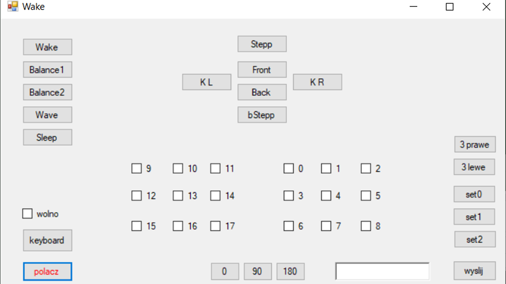
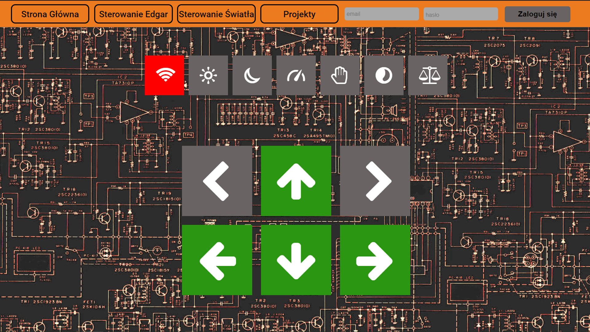

# Edgar v1.0

Wrzuciłem kod w c# i w Arduino przeznaczony do sterowania robotem.

Sterowanie robotem napisałem na 2 różne sposoby:

1) Lokalnie poprzez wysyłanie socketów za pomocą aplikacji w c# na lokalne IP płytki Wemos D1 mini(folder Klient oraz localControl.ino):

2) Globalnie poprzez wysyłanie zapytań http metodą POST z wykorzystaniem baz danych(edgarWebpage.ino):

